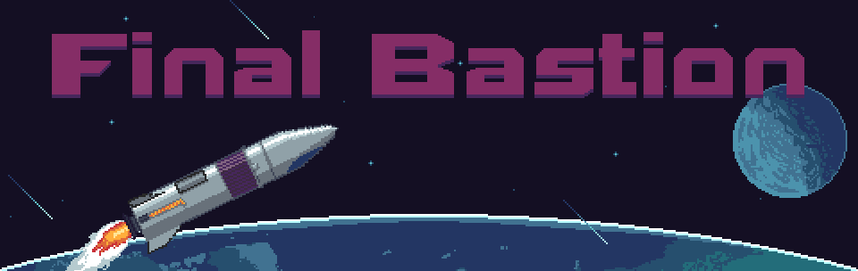
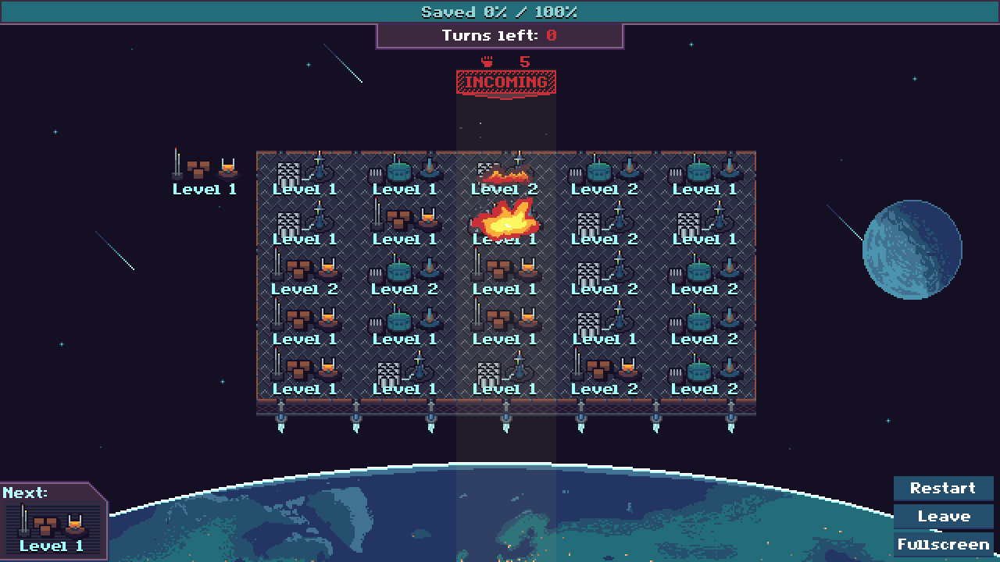
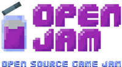

# Final Bastion

> Commander! Large meteoroid storms are incoming! You will have to defend the Earth on the Final Bastion, while we are evacuating.

Final Bastion is a creative puzzler with elements from classic Tower Defense games and 2048. You will have to upgrade your turrets while placing a new turret each round. Every 5 turns you will have to eliminate a growing meteoroid storm before it hits the earth.

How many people can you save?

## Install

Clone the directory and use a Godot 3.1.1 build or simply download the executables at [magodev.itch.io](https://magodev.itch.io/final-bastion).

## Open Jam

Final Bastion is my contribution to the:

## Used Tools

This game was done using only free and open-source software:

- [Godot Engine 3.1.1](https://godotengine.org/)
- [LibreSprite](https://github.com/LibreSprite/LibreSprite)
- [JFXR](https://github.com/ttencate/jfxr)
- [Audacity](https://www.audacityteam.org/)

Developed on Linux Mint :)

## License

All assets are released und the '[The Unlicense](./LICENSE)' license expect the epic soundtrack from [Rafael Krux](https://www.orchestralis.net/#/) which is licensed under [Creative Commons 0](https://creativecommons.org/publicdomain/zero/1.0/).
